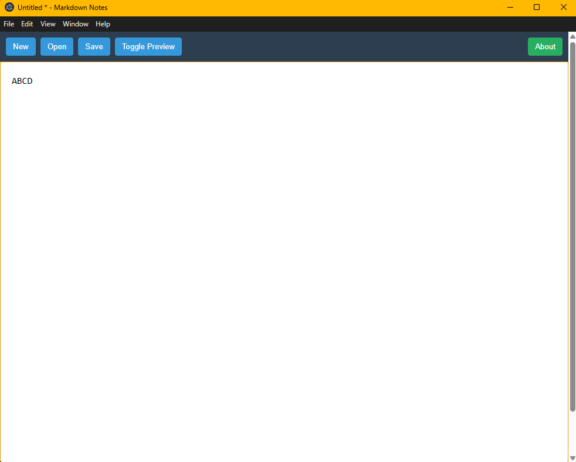
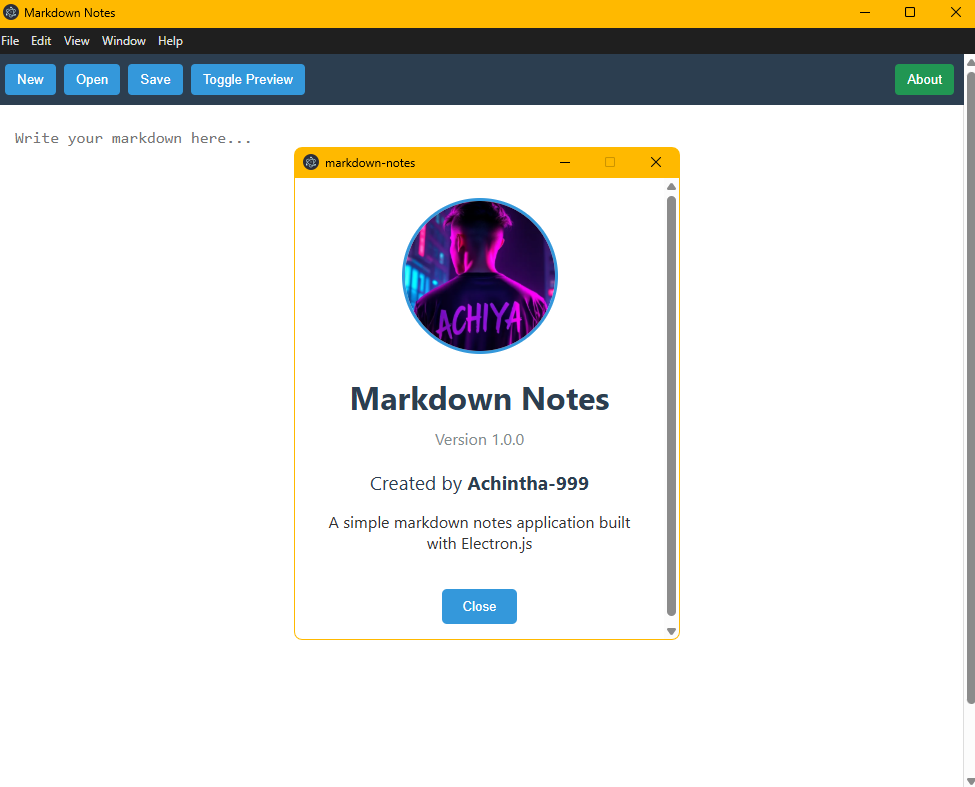

# Electron Markdown Editor


*A lightweight, cross-platform desktop application for creating and managing Markdown notes.*

---

## 🚀 Features

- **Markdown Support**: Write and preview Markdown notes seamlessly.
- **Cross-Platform**: Works on Windows, macOS, and Linux.
- **Simple Interface**: Focus on productivity with a clean and intuitive UI.
- **Live Preview**: See your Markdown rendered in real-time.
- **File Management**: Save, load, and organize your notes easily.

---

## 🛠️ How It Works

### Installation
1. Clone the repository:
   ```bash
   git clone https://github.com/Achintha-999/electron-markdown-editor.git
   ```

2. Navigate to the project directory:
```
cd electron-markdown-editor
```   

3. Install dependencies:
```
npm install
```
4. Install dependencies:
```
npm start
```

## Usage

- Open the application.
- Create a new Markdown file or load an existing one.
- Write your notes in the editor pane.
- View the live preview of your Markdown in the preview pane.
- Save your notes locally for future use.

📂 Project Structure
electron-markdown-editor/
├── src/                # Source code for the application
├── assets/             # Images, icons, and other assets
├── package.json        # Project dependencies and scripts
├── README.md           # Project documentation
└── main.js             # Electron main process


📸 Screenshots
Editor Interface

Live Preview

🤝 Contributing
Contributions are welcome!
Feel free to open issues or submit pull requests to improve the project.

